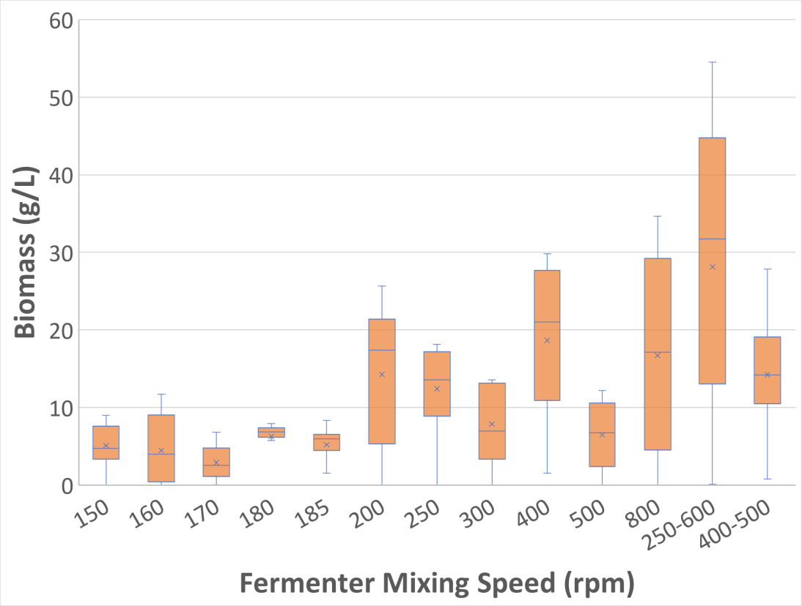
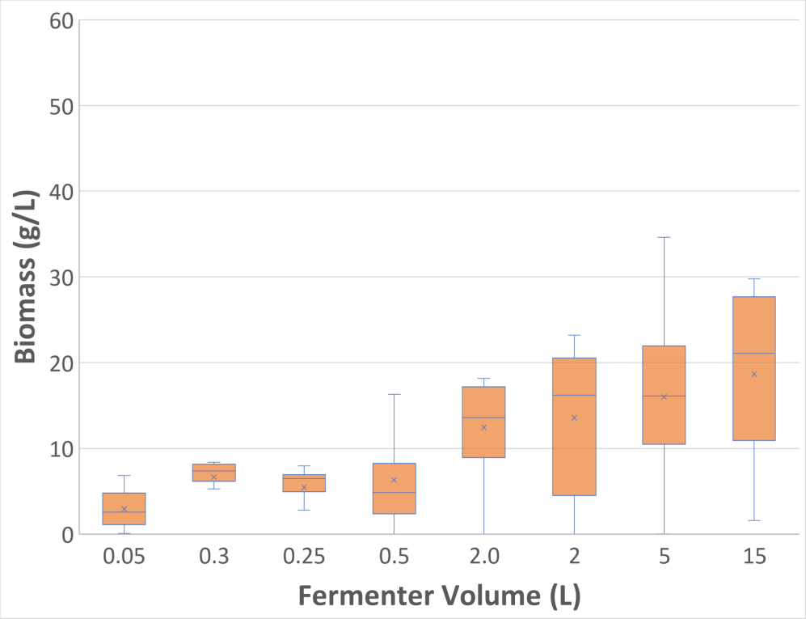
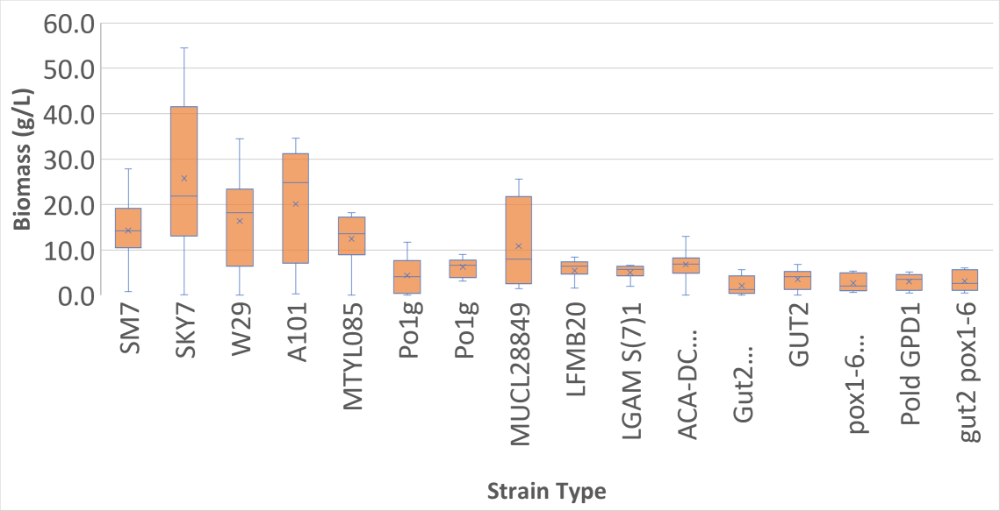
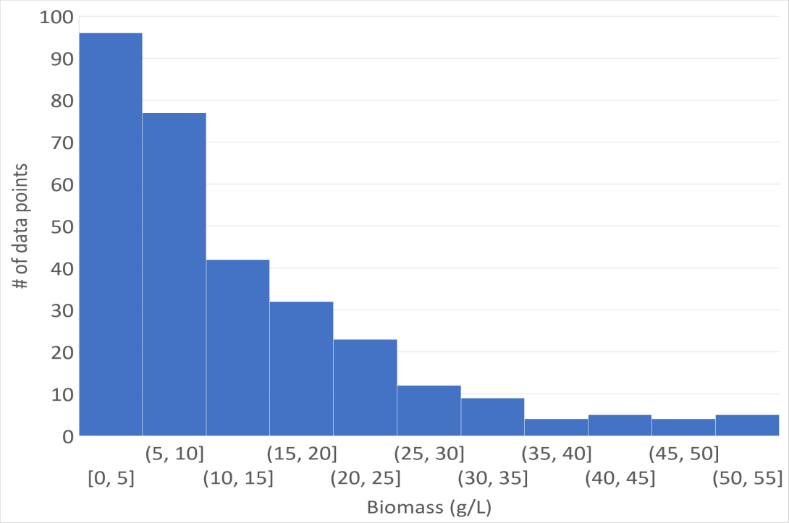
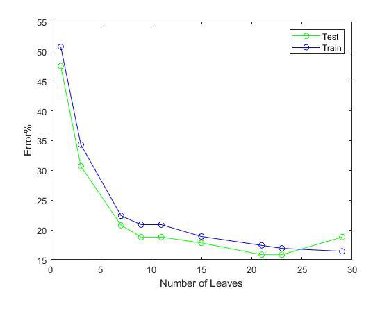
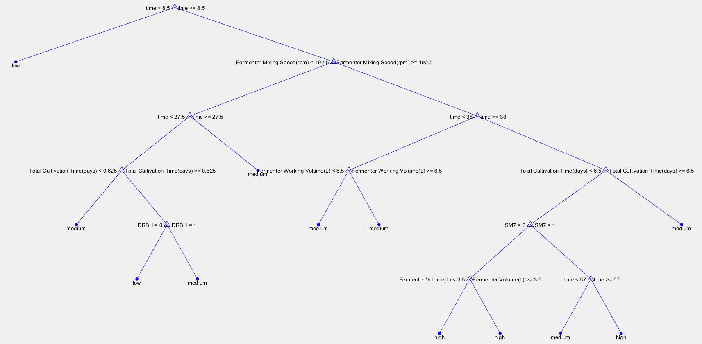
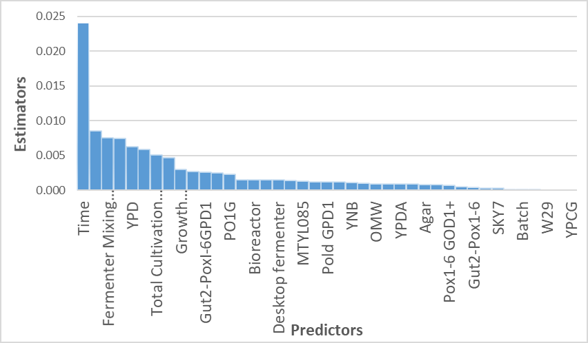
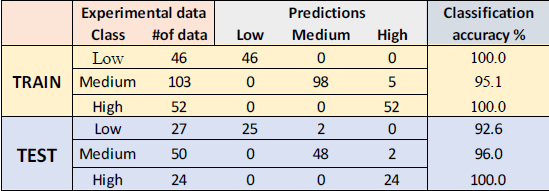

# **Analysis of Biofuel Production from Oleaginous Yeasts Using Machine Learning Tools**
## Authors: *Daglar Berk Erdem* 
## Introduction
In this study, data of biomass production of yarrowia lipolytica yeasts regarding 41 different input variables are collected. Those data are categorized in 3 classes. High, low and medium, which contains first interquartile, third interquartile and the rest, respectively.
\Most important inputs are analyzed before proceeding to Matlab calculations and compared with the results. Those data are exercised through Matlab and fit into a decision tree model. Best conditions for high biomass production are identified as, fermenter speed must be greater than 192 rpm, Time must be greater than 38 hours Strain type should not be SM7, otherwise time must be greater than 57 hours. Resulting biomass will be greater than 18.4 g/L, which is categorized as high.
\Pre-analysis of input importance are proved by decision tree model and input importance graph.
\High accuracies are obtained in confusion matrix. However, those values are expected to be lower in real life. This overestimation can be prevented by choosing data to test/train article by article, instead choosing randomly among them.
## Analyses&Results
### Pre-Analysis
Before proceeding to MATLAB results, inputs are analyzed through MS Excel and most probably important ones are determined. Box&Whisker Graphs for those mentioned above are given below.\
\
\
\
Outputs were also analyzed and shown below.\

### Decision Tree Model
2/3 of the collected data are exercised in data training, whereas rest is exercised in testing. Resulting tree had 27 branches. However, after analyzing the error vs testing and training graph, optimum tree is decided to have 23 branches.\
\
The necessary condition to decide optimum tree is to identify minimum error in testing. The reason is, as number of leaves increases, overlearning starts in data training. Which results in lowering the train error. However, error in testing expected to decay, then increase. As a result, minimum point of testing error has to be chosen as optimum tree.
\23 branches are the optimum number of leaves in tree model, which can be seen from Figure 3.5.
\Optimum tree is calculated by using the Matlab script “YeastDecTree” and shown below.
\
It can be observed that, expected key inputs appeared in decision tree alongside with time.
### Input Significance
An analysis on significance of inputs are performed in Matlab by using the script “inputimportance” and shown below.\

### Confusion Matrix
Lastly, confusion matrix is constructed in order to find out the accuracies of the results. This matrix is constructed by using Matlab script “confusionmat”.\
\
## Conclusion
As conclusion, even though number of data are relatively low, they fit into a model and give meaningful results. Moreover, 6 input out of 41 are realized to be very important compared to the rest, which can be observed in figure 3.7. Time is the most important input since the collected data are non-steady state and samples are collected in batch mode of operation.
\By considering figure 3.8., best conditions to obtain high biomass are, Fermenter speed must be greater than 192 rpm, Time must be greater than 38 hours Strain type should not be SM7, otherwise time must be greater than 57 hours. Resulting biomass will be greater than 18.4 g/L, which is categorized as high.
\There might be some overprediction in testing accuracy, which may be lower in real life. This overestimation can be prevented by choosing data article by article, instead using random matrices.
\Pre-Analysis of importance of inputs is proved by figure 3.6&3.7. As identified in pre analysis, most important parameter such that, time, fermenter volume, mixing speed, seed growth medium type etc. are appeared in decision tree and input importance graphs.
## Installation
Clone this git repository by using the command:
```
git clone https://github.com/dberkerdem/yeast_decision_tree.git
```
## Usage
This project is available in .m extension, can be used with MATLAB. Run YeastDecTree.m script.
## License
[MIT](https://choosealicense.com/licenses/mit/)